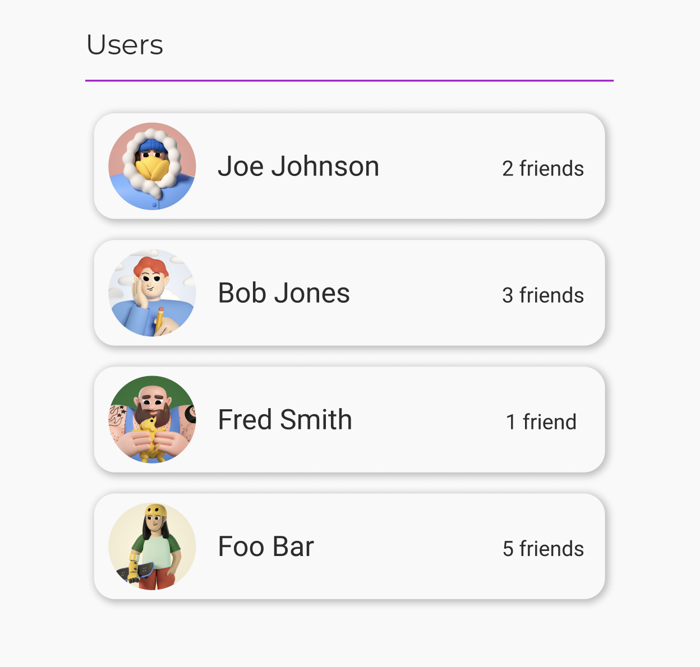
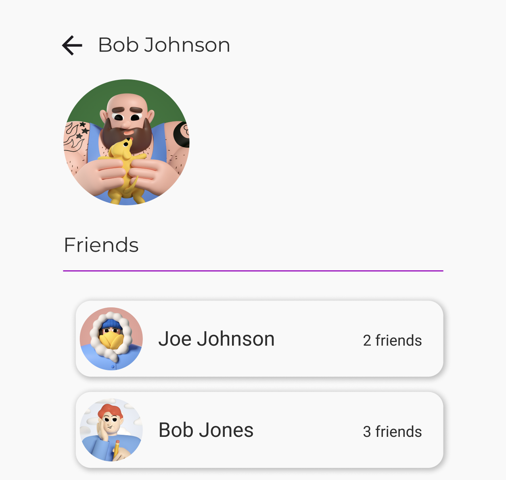

This is a [Next.js](https://nextjs.org) project bootstrapped with [`create-next-app`](https://nextjs.org/docs/app/api-reference/cli/create-next-app).

# The goal

Create a NextJS website that utilizes an API to render a list of users. Clicking on a user will show their profile and allow for navigating to one of their friend's profiles.

# My process

### Quick design
Before I started to write any code, I went into [Figma](https://www.figma.com/) and made a quick design. Even if that vision is _blurry_ to start, it helps me move fast:

### Project generation
Then I generated the project with `npx create-next-app@latest`, as this was the latest command available via the [NextJs docs](https://nextjs.org/docs/app/getting-started/installation). The following are the options I selected and why:
- TypeScript: I feel that having the additional layer of types not only helps me code faster, but with more confidence.
- ESlint: Clean, readable code is easier to test, update or refactor. Plus this saves me time on formatting by having my IDE automatically run my `lint --fix` on save.
- TailWindCSS: This will give me some basic styles out of the box, saving me time.

### Project setup
#### Frontend
- The first step is clearing out the boilerplate files and rendering a simple page at the route: "/" with the text: "Users".
- Then I'll add all the necessary icons and images to the `public/` folder.
- Quickly update the html metadata via `layout.tsx`.
- Now time to update the styles and fonts. By matching my theme in code to the color/size values from the design, I'll spend less time tweaking CSS.

Now that I feel like the project is in a good place to create the necessary frontend components, I'll move on to setting up the backend API.

#### Backend
- I'm going to install the bare minimum to get a basic GraphQL server running. The reason I choose this over REST is that it will allow me to have better type safety across the frontend and backend, especially if something like [codegen](https://the-guild.dev/graphql/codegen) is installed.
- Following the instructions on the npm package `@as-integrations/next`, I'll create a basic GraphQL server and test it with an API debugging tool, such as [yaak](https://yaak.app/).
    - I did get stuck here for a little bit. I did not realize that, because this version of NextJS uses App Router by default, I needed to change my filename for my graphql server from `index.ts` -> `route.ts`. Initially, I was seeing "cors" related logs when trying to test the API, so I spun my wheels for a little searching that before reading definitively that NextJS, by default, [should allow localhost](https://nextjs.org/docs/app/api-reference/config/next-config-js/allowedDevOrigins). I was able to resolve this issue by searching for "nextjs app router api 404" and finding a [stackoverflow post](https://stackoverflow.com/questions/76336930/fetching-next-js-api-route-in-the-app-directory-gives-404-not-found).

The final setup step is to ensure that the data is available inside my page components. For this, I'll use [Apollo](https://www.apollographql.com/) client, as it provides a quick and clean way to interact with my GraphQL API and has plenty of support/documentation.

### Feature execution
blah
